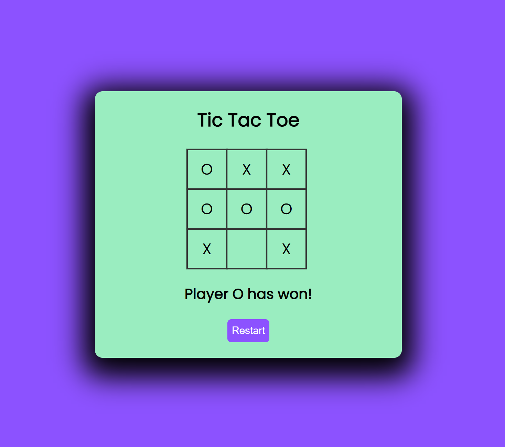

# PRODIGY_WD_03

## TASK 3 TIC TAC TOE GAME

This repository contains a simple Stopwatch web application project developed using HTML, CSS, and JavaScript, created as part of my internship at PRODIGY INFOTECH.

## Overview

This web application allows two players to play the classic game of `Tic Tac Toe` on the same system. Players can take turns marking X and O on the game board until there's a winner or a draw.



## Features
- Two players take turns marking X and O on the game board.
- The game displays whose turn it is (Player X or Player O).
- Players can restart to start a new game.
- The game announces the winner or declares a draw when the game ends.

## Usage
- Clone or download this repository to your local machine.
- Open the `index.html` file in your web browser.


## Getting Started

To get started with the Stopwatch web application, follow these steps:

1. Clone the repository to your local machine:

   ```bash
   git clone https://github.com/HariR1893/PRODIGY_WD_03.git
   ```
2. Navigate to the project directory:
   `cd PRODIGY_WD_03`

3. Start the development server:
    `npm run start`
   
5. The app will open in your default web browser at `http://localhost:3000.`

Feel free to explore and customize this project as you see fit. It's a great way to gain practical experience in web development during your internship at PRODIGY INFOTECH!
